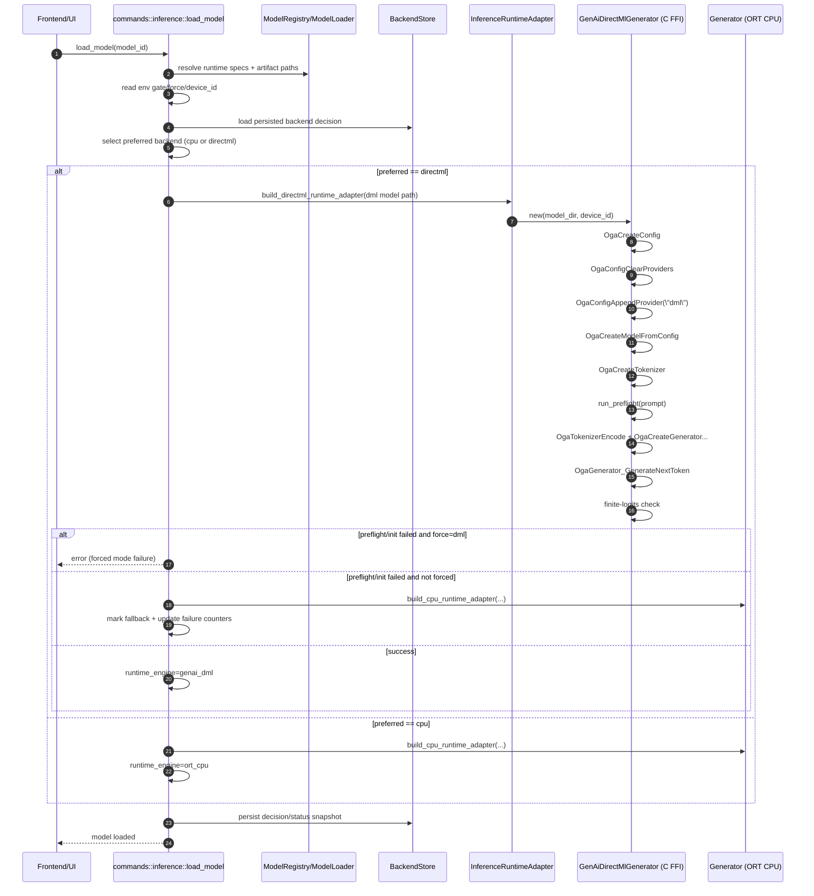
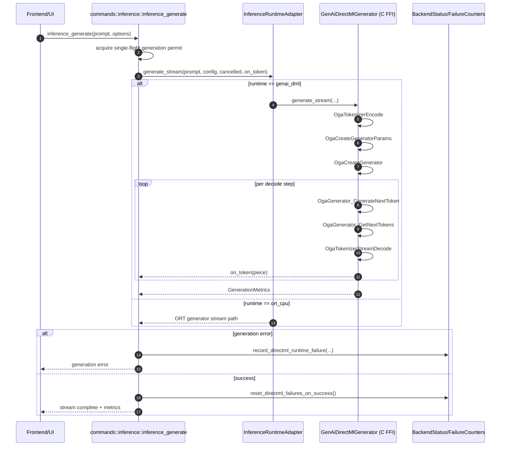

# DirectML Inferencing: Full Rundown (Blocker, Fix, and Runtime Flow)

## Executive summary

DirectML started working after we moved DirectML generation from our custom Rust+ORT loop to ONNX Runtime GenAI's native runtime via a Rust-to-C API bridge (C FFI).  

The previous path was hitting provider-specific contract mismatches (input schema, cache semantics, decode behavior), which surfaced as:

- `GroupQueryAttention ... 0x80070057 The parameter is incorrect`
- missing required inputs like `position_ids`
- non-finite logits (NaN) and degenerate output

The GenAI C runtime path fixed this by delegating provider-sensitive generation details to the runtime designed for that job.

## What was the initial blocker?

The app initially used a generic ORT session path for both CPU and DirectML with a Rust-managed generation loop and KV cache logic.

That worked on CPU but failed on DirectML because DirectML kernels were stricter and the exported DML model contract differed from CPU assumptions:

- Runtime input contract differences (`attention_mask` vs exported schema fields)
- Extra required tensors for some exports (`position_ids`, sequence length counters)
- Stricter shape/length expectations in attention/GQA nodes
- KV cache update semantics differing from our manual loop

The first hard error was:

- `Non-zero status code while running GroupQueryAttention ... 0x80070057 The parameter is incorrect`

After partial local fixes, additional symptoms showed the underlying contract mismatch remained:

- forced mode probe failures
- NaN logits in preflight
- repetitive/degenerate output tokens

## What is C FFI?

FFI means *Foreign Function Interface*: a way for one language to call code compiled in another language.

C FFI specifically means using the C ABI (calling convention and memory layout rules) as the interface boundary.

In this project:

- Rust loads `onnxruntime-genai.dll`
- Rust resolves C symbols (`Oga*` APIs)
- Rust converts data to C-safe types (C strings, pointers)
- Rust calls GenAI C functions for model/config/tokenizer/generator
- Rust explicitly manages object lifetimes with paired destroy calls

This is implemented in:

- `src-tauri/src/inference/genai/directml.rs`

## Why the C FFI approach fixed DirectML

The fix was architectural, not just one parameter tweak.

Instead of reproducing provider-specific generation details in Rust, we now:

- create and run a GenAI model with DirectML provider through official C APIs
- let GenAI handle decode loop details expected by that export/runtime path
- keep Rust focused on app orchestration (selection, fallback, status, streaming callback)

This removed the fragile mismatch layer between:

- our custom loop and
- DirectML-exported model/runtime expectations

## What changed in the codebase

Core additions:

- `src-tauri/src/inference/genai/directml.rs`
- `src-tauri/src/inference/genai/mod.rs`
- `src-tauri/src/inference/runtime_adapter.rs`

Orchestration updates:

- `src-tauri/src/commands/inference.rs`

Runtime dependency setup:

- `scripts/setup-libs.sh` now fetches `onnxruntime-genai.dll` (DirectML package path)

## Runtime selection and gating

DirectML GenAI path is explicitly gated:

- `SMOLPC_ENABLE_DML_GENAI=1` enables DirectML GenAI candidate path
- `SMOLPC_FORCE_EP=dml` forces DirectML selection
- `SMOLPC_DML_DEVICE_ID=<n>` optionally pins device id

Behavior:

- If forced DML and gate is off, load fails early with clear error
- If DML init/probe fails and not forced, fallback to CPU is applied
- Failure counters are tracked and can demote DML after repeated failures

## Sequence: load_model -> backend selection -> runtime init

## Sequence: inference_generate -> token loop -> failure handling

## Practical impact

- DirectML became stable enough to use in forced mode when artifact + runtime are aligned
- Performance improved significantly because generation responsibilities moved to GenAI runtime
- Backend state is now explicit (`runtime_engine`, probe status, failure counters)
- CPU fallback remains safe and automatic when DirectML path degrades

## Key file map for supervisor review

- `src-tauri/src/inference/genai/directml.rs`  
  Rust <-> GenAI C runtime bridge; provider setup and decode loop

- `src-tauri/src/inference/runtime_adapter.rs`  
  Unified adapter over ORT CPU and GenAI DirectML engines

- `src-tauri/src/commands/inference.rs`  
  Backend selection, gating, preflight, fallback/demotion, status reporting

- `scripts/setup-libs.sh`  
  Runtime dependency install including `onnxruntime-genai.dll`

